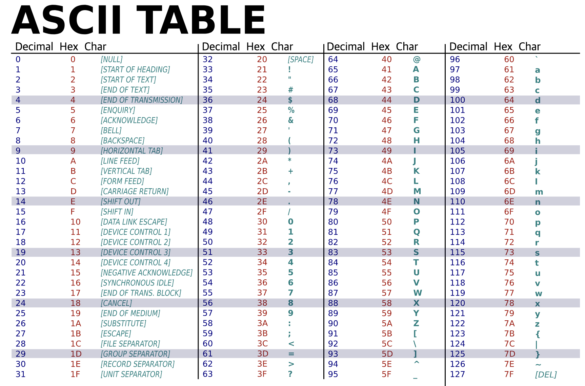

## 알고리즘 문제풀이

<h3> 24.08 (leetcode) </h3>

`Array`
  
  + Two Sum (problem number 1)
  + Best Time to Buy and Sell Stock (problem number 121)
  + Insert Interval (problem number 57)
  + Majority Element (problem number 169)
  + Contains Duplicate (problem number 217)
  + Move Zeroes (problem number 283)
  

<h3> 24.09 (leetcode) </h3>

`Array`

  + Squares of a Sorted Array (problem number 977)

`String`

  + Valid Palindrome (problem number 125)

---
<h3> Issue remembrance </h3>

`problem number 121`
  
  + 첫 접근은 재귀적 접근으로 풀이
  + 시간 복잡도 O(N) 제한사항인걸 알았지만 실제 코드를 작성해보니 O(N^2)
  + 재귀적 접근으로만 생각하니 O(N) 솔루션이 생각 안남
  + discuss 참고 후 새로운 접근법 적용 O(N)
  + 아직 문제를 읽을 때 재귀가 필요한지 아닌지 구분 어려움
  + solution. 재귀를 먼저 떠올리기 보다 입력을 순회하며 처리하는 방안을 먼저 고려하자.

`problem number 57`
  
  + 2차원 리스트 → 2차원 배열로 변환
  + 새로운 배열의 end값이 비교중인 기존 배열 start값 보다 작다면 다음 요소들을 붙여서 반환
  + 기존 배열이 비어있을 경우 새로운 배열만 반환

`problem number 217`
  
  + 첫 접근은 입력으로 주어진 배열의 각 수를 인덱스 번호로하는 새로운 인덱스 생성
  + 새로운 배열의 인덱스를 입력 배열의 각 수가 출현하면 증가
  + IndexOutOfBoundsException 발생
    + 입력이 음수일 경우
    + 입력 배열 중 {1,2,3,100000}일 경우
    + 입력 배열이 하나일 경우
  + 위 오류를 배열로만 처리하려다보니 경우의 수가 많아짐
  + 고민하다 solution 확인. HashSet 구현해 해결.

`problem number 283`

  + 첫 접근은 입력으로 주어진 배열을 순회하며 '0' 위치를 끝 요소로 이동
  + 결과적으로 앞 요소는 정렬되지 않은 수 가 된다
  + 모두 이동 후 '0' 인덱스 전 까지 정렬을 해주었다
  + 하지만, 문제에서는 앞 요소들이 정렬 된 것이 아니라 상대적 위치로 나열되어야 했다.

```
right answer.
[4,0,1,0,3] → [4,1,3,0,0]

wrong answer.
[4,0,1,0,3] → [1,3,4,0,0]
```

  + 처음에는 상대적 위치를 고려했지만 코드 작성 하다보니 상대적 위치 조건을 잊어버림...
  + solution 확인. '0'이 아닌 수를 앞으로 옮긴 후
  + '0'이 채워져야 하는 position 을 기억해 해당 position 부터 끝 까지 채운다

`problem number 125`

  + ASCII TABLE 활용하면 실행시간을 줄일 수 있었다.



